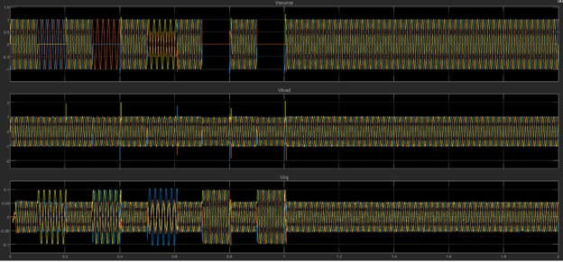
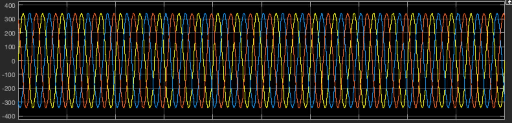
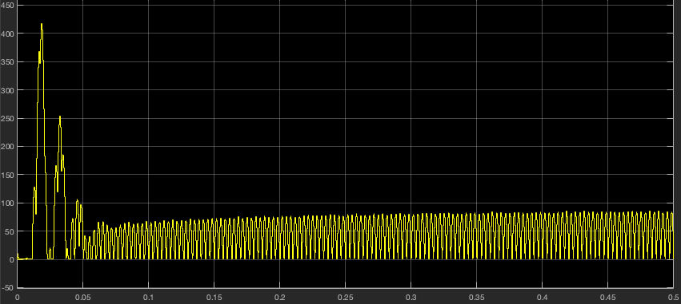
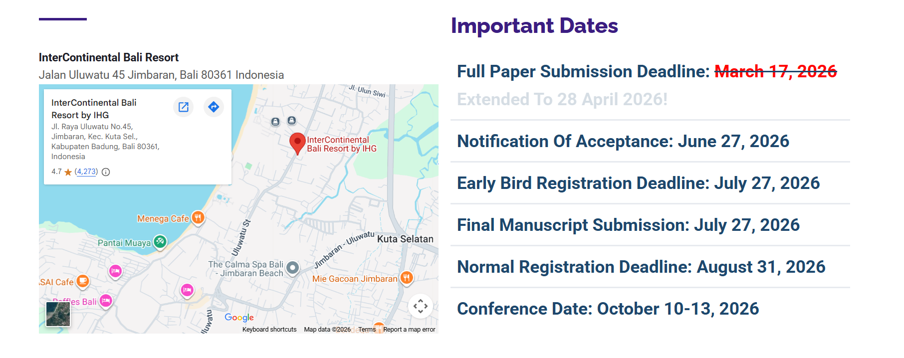

# TITILE : ANALYSIS OF POWER, REACTIVE POWER AND VOLTAGES PROVIDED STATCOM AND DVR DURING FAULT AND LOAD ADDITION AND DETERMINATION OF OPTIMAL PLACEMENT USING REINFORCEMENT LEARNING ON SANEPA FEEDER OF KATHMANDU 

## Update 1st April (daari)
## Different Types of fault and response of Dvr in Different Fault type

### 1. Source Voltage (Vsource)

The source voltage experiences different types of faults over time:

- **0.1–0.2 sec → LG fault**
- **0.3–0.4 sec → LLG fault**
- **0.5–0.6 sec → LL fault**
- **0.7–0.8 sec → LLL fault**
- **0.9–1 sec → LLLG fault**

These faults cause:
- Voltage sags  
- Unbalance between phases  
- Distorted waveforms  

> Severity increases from **LG → LLLG**

---

### 2. Load Voltage (Vload)

Despite disturbances in the source:

- The load voltage remains **nearly constant**
- Waveform is **balanced and sinusoidal**
- Only very small transients appear at fault instants  

This confirms that the **load is effectively protected**

---

### 3. Injected Voltage (Vinj)

The DVR injects voltage only during fault periods.

**Key characteristics:**

- Injection is **dynamic and adaptive**
- Magnitude varies depending on fault type:
  - Small → LG  
  - Medium → LL / LLG  
  - Large → LLL / LLLG  

**Injection ensures:**
- Compensation of voltage drop  
- Phase correction  

---

##  Conclusion

The Dynamic Voltage Restorer (DVR) effectively maintains power quality by compensating voltage sags and ensuring a stable, balanced load voltage under all fault conditions.
## Update 31 March (Neshan)

STATCOM model for singular grid and singular load is completed.
Reactive power is supplied by inverter but the grid also provides enough for the load.
Source current is very high.

But the voltage maintains constant value.

Probably need to fix PID.
Also reference voltage for the inverter is also fluctuating and failing to maintain the value of 800V.
 maintaineance of around 50 V is seen.

May have been problem on inverter and PLL as well.
Trying to design new singular grid with diffrent inverter, controller and PLL.

## Conference Details

